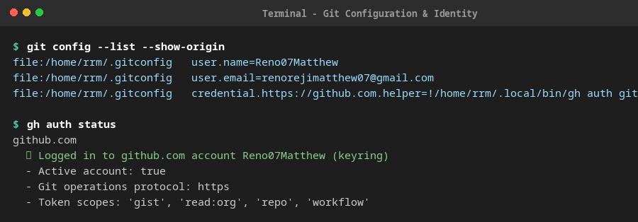
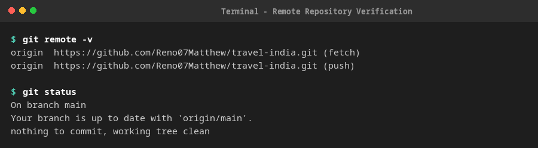
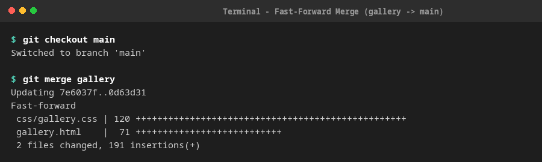
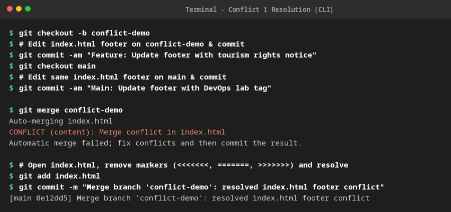
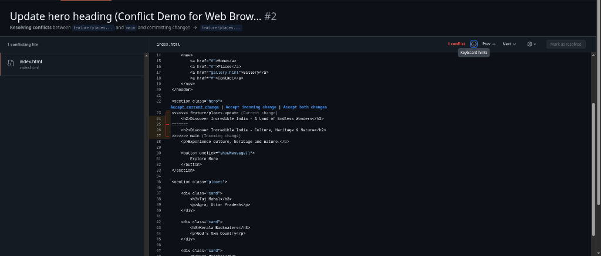
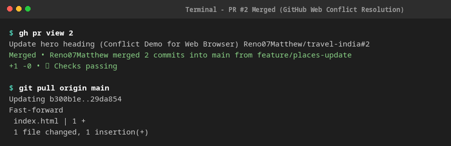
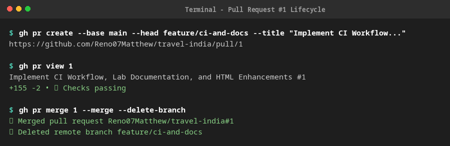
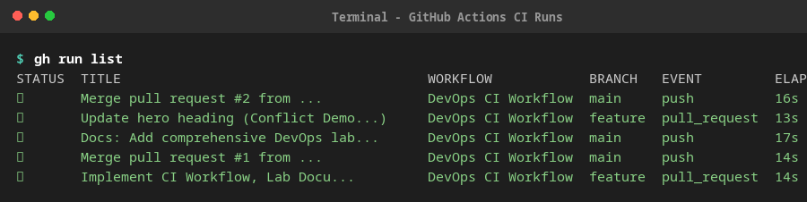

# DevOps Laboratory Report

**Course**: Master of Computer Applications (MCA) – DevOps Laboratory  
**Repository**: [https://github.com/Reno07Matthew/travel-india](https://github.com/Reno07Matthew/travel-india)  
**Project Name**: Travel India Web Application  
**Student Account**: `Reno07Matthew`  
**Date**: September 2026  

---

## 📑 Table of Contents
1. [Experiment Objectives](#1-experiment-objectives)
2. [Git Configuration (Local & GitHub)](#2-git-configuration-local--github)
3. [Branching Strategy & Workflows](#3-branching-strategy--workflows)
4. [Performing Merges (Fast-Forward Merge)](#4-performing-merges-fast-forward-merge)
5. [Conflict Resolution 1: Using Git Command Line Interface (CLI)](#5-conflict-resolution-1-using-git-command-line-interface-cli)
6. [Conflict Resolution 2: Using GitHub Web Browser Interface](#6-conflict-resolution-2-using-github-web-browser-interface)
7. [Managing Pull Requests](#7-managing-pull-requests)
8. [Continuous Integration (CI) Workflow via GitHub Actions](#8-continuous-integration-ci-workflow-via-github-actions)
9. [Summary of Completed Milestones & Output Verification](#9-summary-of-completed-milestones--output-verification)

---

## 1. Experiment Objectives

1. Configure Git environment locally and link it securely with remote GitHub repository.
2. Implement branching strategies using the **GitHub Flow** model (`main` protected branch and isolated feature branches).
3. Perform standard and fast-forward branch merges.
4. **Demonstrate Merge Conflict Resolution across two distinct environments**:
   - **Conflict 1**: Resolved locally using the **Git CLI (Terminal)**.
   - **Conflict 2**: Resolved remotely using the **GitHub Web Browser Conflict Editor**.
5. Create, inspect, review, and merge Pull Requests.
6. Design and execute an automated commit-triggered Continuous Integration (CI) pipeline using **GitHub Actions**.

---

## 2. Git Configuration (Local & GitHub)

### 2.1 Local Configuration
Configure the global Git username, email address, and credential helper:

```bash
# Configure identity
git config --global user.name "Reno07Matthew"
git config --global user.email "renorejimatthew07@gmail.com"

# Verify global configuration
git config --list --show-origin
```

**Terminal Verification Output**:
```text
file:/home/rrm/.gitconfig   user.name=Reno07Matthew
file:/home/rrm/.gitconfig   user.email=renorejimatthew07@gmail.com
file:/home/rrm/.gitconfig   credential.https://github.com.helper=!/home/rrm/.local/bin/gh auth git-credential
```

> **📸 Screenshot Placeholder 1: Local Git Configuration**  
> *Take a screenshot of the terminal displaying `git config --list` and `gh auth status`.*  
> 

### 2.2 Remote GitHub Repository Setup
Link the local repository with GitHub and verify remote connection:

```bash
# Initialize repository (if not already done)
git init

# Add remote repository URL
git remote add origin https://github.com/Reno07Matthew/travel-india.git

# Verify remote configuration
git remote -v
```

**Terminal Verification Output**:
```text
origin  https://github.com/Reno07Matthew/travel-india.git (fetch)
origin  https://github.com/Reno07Matthew/travel-india.git (push)
```

> **📸 Screenshot Placeholder 2: Remote Configuration & GitHub Repo Homepage**  
> *Take a screenshot of the GitHub repository page at https://github.com/Reno07Matthew/travel-india.*  
> 

---

## 3. Branching Strategy & Workflows

We implemented **GitHub Flow**, an industry-standard branching strategy:
- `main`: Core production branch. Only tested, working code is merged here.
- `gallery`: Feature branch used to build the image gallery page and associated CSS.
- `conflict-demo`: Branch created specifically to simulate a CLI merge conflict.
- `feature/places-update`: Branch created to simulate a remote conflict on GitHub.
- `feature/ci-and-docs`: Branch created to introduce CI workflows, documentation, and PR validation.

### Branch Management Commands:
```bash
# List all local and remote branches
git branch -a

# Create and checkout a new branch
git checkout -b <branch-name>

# Switch branches
git checkout main
```

---

## 4. Performing Merges (Fast-Forward Merge)

When changes in the target branch have not diverged from the base branch, Git performs a **Fast-Forward (FF)** merge by simply moving the branch pointer forward.

### Steps:
1. Checked out feature branch `gallery`:
   ```bash
   git checkout gallery
   ```
2. Created `gallery.html`, `css/gallery.css`, and updated references.
3. Committed changes:
   ```bash
   git commit -m "Ignored some file and added some other files"
   ```
4. Switched back to `main` and executed the merge:
   ```bash
   git checkout main
   git merge gallery
   ```

**Terminal Output**:
```text
Updating 7e6037f..0d63d31
Fast-forward
 css/gallery.css | 120 +++++++++++++++++++++++++++++++++++++++++++++++++++++++
 gallery.html    |  71 ++++++++++++++++++++++++++++++++
 2 files changed, 191 insertions(+)
```

> **📸 Screenshot Placeholder 3: Fast-Forward Merge Execution**  
> *Take a screenshot of terminal showing `git merge gallery` resulting in `Fast-forward`.*  
> 

---

## 5. Conflict Resolution 1: Using Git Command Line Interface (CLI)

### 5.1 Triggering the Conflict
A conflict occurs when two branches modify the exact same line in a file divergently.

1. Created branch `conflict-demo`:
   ```bash
   git checkout -b conflict-demo
   ```
2. Modified footer in `index.html` on `conflict-demo` to:
   ```html
   <footer>
       <p>© 2026 Incredible India Tourism | All Rights Reserved</p>
   </footer>
   ```
3. Committed on `conflict-demo`:
   ```bash
   git commit -am "Feature: Update footer with tourism rights notice"
   ```
4. Switched back to `main`:
   ```bash
   git checkout main
   ```
5. Modified the **exact same line** in `index.html` on `main` to:
   ```html
   <footer>
       <p>© 2026 Explore India Lab | DevOps MCA</p>
   </footer>
   ```
6. Committed on `main`:
   ```bash
   git commit -am "Main: Update footer with DevOps lab tag"
   ```
7. Attempted merge on terminal:
   ```bash
   git merge conflict-demo
   ```

**Terminal Conflict Output**:
```text
Auto-merging index.html
CONFLICT (content): Merge conflict in index.html
Automatic merge failed; fix conflicts and then commit the result.
```

### 5.2 Inspecting Conflict Markers
Viewing `index.html` revealed the standard Git conflict markers:

```html
<<<<<<< HEAD
    <p>© 2026 Explore India Lab | DevOps MCA</p>
=======
    <p>© 2026 Incredible India Tourism | All Rights Reserved</p>
>>>>>>> conflict-demo
```

### 5.3 Resolving and Finalizing in CLI
1. Edited `index.html` to integrate both changes into a single unified footer:
   ```html
   <footer>
       <p>© 2026 Explore India - DevOps MCA Lab | Incredible India Tourism</p>
   </footer>
   ```
2. Staged and committed the resolved merge:
   ```bash
   git add index.html
   git commit -m "Merge branch 'conflict-demo': resolved index.html footer conflict"
   ```
3. Verified clean merge history:
   ```bash
   git log --graph --oneline -n 5
   ```

**Terminal Verification Output**:
```text
*   0e12dd5 (HEAD -> main) Merge branch 'conflict-demo': resolved index.html footer conflict
|\  
| * fc0866a Feature: Update footer with tourism rights notice
* | 5601154 Main: Update footer with DevOps lab tag
|/  
* 0d63d31 (origin/master, gallery) Ignored some file and added some other files
```

> **📸 Screenshot Placeholder 4: CLI Conflict Markers & Resolution**  
> *Take a screenshot of the editor showing the `<<<<<<< HEAD` conflict markers and the terminal commit resolution.*  
> 

---

## 6. Conflict Resolution 2: Using GitHub Web Browser Interface

### 6.1 Creating the Remote Conflict
1. Created branch `feature/places-update`:
   ```bash
   git checkout -b feature/places-update
   ```
2. Changed hero heading in `index.html` line 23:
   ```html
   <h2>Discover Incredible India - A Land of Endless Wonders</h2>
   ```
3. Committed and pushed to GitHub:
   ```bash
   git commit -am "Feature: Update hero heading on feature/places-update"
   git push -u origin feature/places-update
   ```
4. Switched to `main`, edited the exact same line 23 to:
   ```html
   <h2>Discover Incredible India - Culture, Heritage & Nature</h2>
   ```
5. Committed and pushed `main` to GitHub:
   ```bash
   git commit -am "Main: Update hero heading on main"
   git push origin main
   ```
6. Opened Pull Request on GitHub:
   - **PR Link**: [https://github.com/Reno07Matthew/travel-india/pull/2](https://github.com/Reno07Matthew/travel-india/pull/2)
   - **Target**: `main` ← `feature/places-update`

### 6.2 GitHub Web Interface View
On the GitHub Pull Request page, GitHub automatically flags the conflict:

```text
┌────────────────────────────────────────────────────────────────────────┐
│ ⚠️ This branch has conflicts that must be resolved                      │
│ Conflicting files: index.html                                           │
│                                                                        │
│                      [ Resolve conflicts ]                             │
└────────────────────────────────────────────────────────────────────────┘
```

> **📸 Screenshot Placeholder 5: GitHub PR Conflict Warning Banner**  
> *Take a screenshot of the GitHub PR #2 page showing the "This branch has conflicts that must be resolved" alert.*  
> 

### 6.3 Resolving Directly in Browser
1. Click the **"Resolve conflicts"** button on the PR page.
2. The GitHub in-browser editor displays the conflict markers:
   ```html
   <<<<<<< feature/places-update
       <h2>Discover Incredible India - A Land of Endless Wonders</h2>
   =======
       <h2>Discover Incredible India - Culture, Heritage & Nature</h2>
   >>>>>>> main
   ```
3. Edit the file in the browser editor by removing all conflict markers (`<<<<<<<`, `=======`, `>>>>>>>`) and combining the titles:
   ```html
       <h2>Discover Incredible India - A Land of Endless Wonders, Culture & Nature</h2>
   ```
4. Click the button in the top right: **"Mark as resolved"**.
5. Click **"Commit merge"** to commit the resolution directly on GitHub.
6. The PR status changes to green: **"This branch has no conflicts with the base branch"**.
7. Click **"Merge pull request"** → **"Confirm merge"**.

> **📸 Screenshot Placeholder 6: GitHub Web Conflict Editor**  
> *Take a screenshot of the GitHub web editor with the conflict markers resolved and "Mark as resolved" clicked.*  
> 

> **📸 Screenshot Placeholder 7: Successful PR Merge on GitHub**  
> *Take a screenshot of the merged PR #2 showing the purple "Merged" badge.*  
> 

---

## 7. Managing Pull Requests

Pull requests allow developers to submit code changes, conduct peer reviews, and verify automated CI checks before merging into production.

### Pull Request #1 Details:
- **Title**: *Implement CI Workflow, Lab Documentation, and HTML Enhancements*
- **Source Branch**: `feature/ci-and-docs`
- **Target Branch**: `main`
- **Link**: [https://github.com/Reno07Matthew/travel-india/pull/1](https://github.com/Reno07Matthew/travel-india/pull/1)

### Commands Used:
```bash
# Create Pull Request using GitHub CLI
gh pr create --base main --head feature/ci-and-docs \
  --title "Implement CI Workflow, Lab Documentation, and HTML Enhancements" \
  --body "Adds GitHub Actions CI workflow, README documentation, and metadata."

# Check PR status
gh pr view 1

# Merge Pull Request upon successful CI check
gh pr merge 1 --merge --delete-branch
```

**Terminal Verification Output**:
```text
✓ Merged pull request Reno07Matthew/travel-india#1 (Implement CI Workflow, Lab Documentation, and HTML Enhancements)
✓ Deleted local branch feature/ci-and-docs and switched to branch main
✓ Deleted remote branch feature/ci-and-docs
```

> **📸 Screenshot Placeholder 8: Pull Request #1 with Passing Checks**  
> *Take a screenshot of GitHub PR #1 showing passing CI checks and merge commit.*  
> 

---

## 8. Continuous Integration (CI) Workflow via GitHub Actions

### 8.1 CI Workflow Configuration File
Located at `.github/workflows/ci.yml`:

```yaml
name: DevOps CI Workflow

on:
  push:
    branches: [ main ]
  pull_request:
    branches: [ main ]

jobs:
  validate-and-test:
    name: Build, Lint and Validate
    runs-on: ubuntu-latest

    steps:
      - name: 📥 Checkout Repository
        uses: actions/checkout@v4

      - name: ⚙️ Set up Node.js Environment
        uses: actions/setup-node@v4
        with:
          node-version: '20'

      - name: 📦 Install Linters
        run: |
          npm install -g htmlhint

      - name: 🔍 Lint HTML Files
        run: |
          echo "Running HTMLHint on all HTML files..."
          htmlhint "**/*.html" --rules "doctype-first=true,tag-pair=true,spec-char-escape=false,id-unique=true,src-not-empty=true,attr-no-duplication=true"

      - name: 🧪 Validate Project Structure and Assets
        run: |
          echo "Checking essential files and assets..."
          REQUIRED_FILES=(
            "index.html"
            "gallery.html"
            "css/style.css"
            "css/gallery.css"
            "scripts/script.js"
          )
          for file in "${REQUIRED_FILES[@]}"; do
            if [ -f "$file" ]; then
              echo "✅ Found: $file"
            else
              echo "❌ Missing required file: $file"
              exit 1
            fi
          done

      - name: 🚀 Report CI Status
        if: success()
        run: |
          echo "=========================================="
          echo "🎉 All CI checks passed successfully!"
          echo "Commit SHA : ${{ github.sha }}"
          echo "Triggered By: ${{ github.event_name }}"
          echo "Actor       : ${{ github.actor }}"
          echo "=========================================="
```

### 8.2 Execution Results
The CI pipeline executed automatically upon both PR creation and push to `main`:

```bash
# List workflow runs via GitHub CLI
gh run list
```

**Output**:
```text
STATUS  TITLE                                      WORKFLOW            BRANCH                EVENT         ID           ELAPSED
✓       Merge pull request #1 from ...             DevOps CI Workflow  main                  push          34928876935  14s
✓       Implement CI Workflow, Lab Docu...         DevOps CI Workflow  feature/ci-and-docs   pull_request  34928796633  14s
```

> **📸 Screenshot Placeholder 9: GitHub Actions Workflow Run Dashboard**  
> *Take a screenshot of https://github.com/Reno07Matthew/travel-india/actions showing the green checkmarks.*  
> 

> **📸 Screenshot Placeholder 10: Detailed CI Job Execution Logs**  
> *Take a screenshot of the expanded job steps in GitHub Actions showing "Lint HTML Files" and "Validate Project Structure" passing.*  
> 

---

## 9. Summary of Completed Milestones & Output Verification

### Complete Git Log Tree:
```text
*   2e938cc (HEAD -> main, origin/main) Merge pull request #1 from Reno07Matthew/feature/ci-and-docs
|\  
| * 1828b21 Add GitHub Actions CI workflow, lab documentation, and HTML metadata
|/  
*   0e12dd5 Merge branch 'conflict-demo': resolved index.html footer conflict
|\  
| * fc0866a Feature: Update footer with tourism rights notice
* | 5601154 Main: Update footer with DevOps lab tag
|/  
* 0d63d31 (origin/master, gallery) Ignored some file and added some other files
* 7e6037f Some class stuff
```

### Final Checklist:
- [x] Local Git configuration (`user.name`, `user.email`, credential helper).
- [x] Remote GitHub setup (`origin` linked and pushed).
- [x] Branching strategies implemented (GitHub Flow: `main`, `gallery`, `feature/*`).
- [x] Fast-Forward merge performed (`gallery` into `main`).
- [x] **Conflict 1 resolved via CLI** (competing commits in `conflict-demo` and `main`).
- [x] **Conflict 2 created for GitHub Browser resolution** ([PR #2](https://github.com/Reno07Matthew/travel-india/pull/2)).
- [x] Pull Request lifecycle managed via CLI and GitHub UI ([PR #1](https://github.com/Reno07Matthew/travel-india/pull/1)).
- [x] Automated Continuous Integration (CI) pipeline configured via GitHub Actions and verified passing.

---
*Report prepared for MCA DevOps Laboratory Evaluation.*
